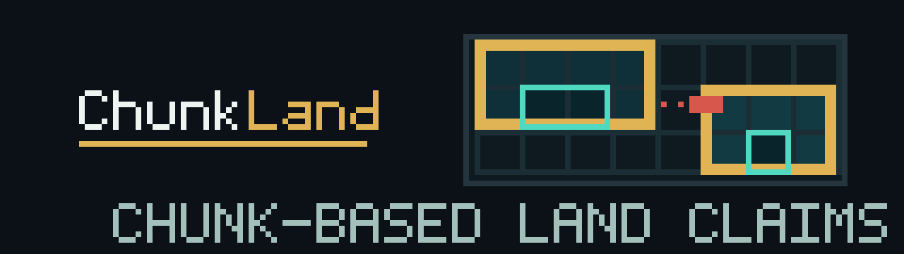

English · [繁體中文](README.zh-TW.md) · [简体中文](README.zh-CN.md)



# ChunkLand

ChunkLand is a land-claim plugin for **Folia 26.2**. Players fence off a claim
with a selection wand, and from then on every attempt to break, place, open,
use, fight inside, or enter that claim is decided individually rather than by a
one-time check when the chunk happens to load.

The current release is **0.1.0** — [download it from the GitHub
Release](https://github.com/smile-minecraft/ChunkLand/releases/tag/v0.1.0). See
[Install](#install) below.

## What it decides

Every check answers one question about one actor at one place: *may this
happen here?* The set ChunkLand currently decides:

- breaking and placing blocks; containers; workstations such as furnaces,
  chests and brewing stands; doors, buttons, levers and other redstone; buckets
  and vehicles; interacting with and damaging entities; item frames, armour
  stands, hanging entities; farmland trampling; PVP; and entering the claim.
- mechanics that cross an edge: pistons, fluid flow, hopper transfer, and
  dispensers that push items across a boundary.
- projectiles, judged when they land rather than where the shooter stood.


### At a glance


*Every image here is an illustration, not a screenshot of a running server. The
boundary diagram shows two neighbouring claims and what their edges stop; the
other five show claiming, growing a land into any shape, who may do what, what
runs inside a land, and sub-lands, all under the shipped defaults.*

## Requirements

| Item | Version |
| --- | --- |
| Server | Folia 26.2 |
| Java | 25 |
| Required plugin | AceLib 1.3.0 |
| Optional | a Vault-ecosystem economy plugin (claim pricing), LuckPerms (quota metadata), CoreProtect (`/land history`) |

Folia only. Paper is not a supported runtime. The plugin descriptor declares
`api-version: '26.1.2'` and the build compiles against paper-api 26.1.2 — both
are compile markers, not a compatibility claim.

## Install

1. Put AceLib 1.3.0 in the server's `plugins/` directory. ChunkLand declares
   `depend: [AceLib]`, so the server will refuse to start ChunkLand without it.
2. Download `chunkland-plugin-0.1.0.jar` from the
   [v0.1.0 release](https://github.com/smile-minecraft/ChunkLand/releases/tag/v0.1.0)
   and copy it into `plugins/`. That single jar is self-contained: the API
   module, SQLite and SnakeYAML are inside it, so no companion jars are needed
   in `plugins/`. `SHA256SUMS` in the same release lists the expected digest of
   every attachment.

   To build it from source instead:

   ```bash
   ./scripts/build-acelib.sh          # fetches AceLib 1.3.0 for compilation
   ./gradlew build --no-daemon --console=plain
   ```

   The server jar lands at `chunkland-plugin/build/libs/chunkland-plugin-0.1.0.jar`.
3. Restart the server. The first start creates `plugins/ChunkLand/` with
   `config.yml`, `lang/en_US.yml`, `lang/zh_TW.yml` and the SQLite database
   `chunkland.db`.
4. Edit `config.yml` if you need to, then restart again. **There is no reload
   command** — every configuration change needs a restart.

Full operator instructions, including what happens when the config file is
broken, are in the [server guide](docs/en/server-guide.md).

## Your first claim

```
/land wand          # receive the selection wand
                    # click one corner, then the opposite corner
/land claim Home    # name the land; you get a confirmation to click
```

Then read it back with `/land inspect`, and see who may act inside it with
`/land explain BLOCK_BREAK`.

The wand, most land commands and the management screen are for players only —
they need you standing inside the land you are working on. Full command list in
the [command reference](docs/en/reference/commands.md).

## Granting players access

Every permission node defaults to `op`, which means **out of the box only
operators can claim land, trust members, or open the management screen.** A
regular player needs the relevant nodes granted explicitly, or they will be
told the command is not allowed. There is no player-facing toggle for this.

All 29 nodes and what each one gates are in the
[permission reference](docs/en/reference/permissions.md). The
`chunkland.admin.*` and `chunkland.debug.*` nodes are for operators; do not hand
them to players.

## Two defaults worth changing before you open a server

**Entry is allowed by default.** `subject-defaults.global.ENTRY: ALLOW` means a
player you have never trusted can walk into a loaded claim. Entry bans still
override it. To close claims to strangers, set it to `DENY`:

```yaml
subject-defaults:
  global:
    ENTRY: DENY
```

**The eleven land rules cannot be changed from anywhere.** They run on built-in
defaults. Inside a land, fluid flow, pistons, hopper transfer and both kinds of
mob spawning follow vanilla; PVP, explosions, fire spread and burn, and mob
griefing are denied. A piston, fluid or hopper that reaches across a land
boundary — in either direction — is always refused. The commented
`rule-defaults` block in `config.yml` is an example, not a wired setting.

The rest of the rough edges — starting a fire is unprotected, `/tp` is not
intercepted, banned players are pushed out on their next move rather than
immediately — are in [LIMITATIONS.md](LIMITATIONS.md).

## Documentation

Guides exist in English, Traditional Chinese and Simplified Chinese under
`docs/`. Each language folder has the same four documents plus a reference
section:

| If you are | Start with |
| --- | --- |
| A player claiming land | [User guide](docs/en/user-guide.md) |
| A server owner installing or configuring | [Server guide](docs/en/server-guide.md) |
| A plugin developer integrating | [Developer guide](docs/en/developer-guide.md) |
| Looking up a command, a config key or the API | [Reference index](docs/en/reference/) |
| Checking what is known to be broken | [Limitations](docs/en/limitations.md) |

Other entry points: [CHANGELOG.md](CHANGELOG.md) for what changed,
[llms.txt](llms.txt) as an index for language models, and
[CONTRIBUTING.md](CONTRIBUTING.md) if you want to work on the plugin.

## Using ChunkLand from another plugin

The API is published on JitPack under the root coordinate
`com.github.smile-minecraft:ChunkLand` — not a module coordinate:

```kotlin
repositories {
    maven { url = uri("https://jitpack.io") }
}

dependencies {
    compileOnly("com.github.smile-minecraft:ChunkLand:v0.1.0") // ChunkLandApi, ChunkLandEventBus, domain types
    compileOnly(files("libs/chunkland-plugin-0.1.0.jar"))      // ChunkLandPlugin
}
```

The JitPack artifact is the API jar alone: domain types, `ChunkLandApi` and the
event bus interface, with no Bukkit, SQL or AceLib — and no plugin class either.
The second entry is what the sample below needs, because `getReadApi()` and
`publicEventBus()` are declared on `com.smile.chunkland.ChunkLandPlugin`, and
that class ships in the plugin jar. Download
`chunkland-plugin-0.1.0.jar` from the
[v0.1.0 release](https://github.com/smile-minecraft/ChunkLand/releases/tag/v0.1.0)
into `libs/`. Code that only passes `ChunkLandApi` values around needs the first
entry on its own. `Bukkit` and the rest of the server API come from the
paper-api compile dependency you already have.

Declare `depend: [ChunkLand]` in your own `plugin.yml` so ChunkLand loads first,
and keep both entries `compileOnly` — the server already provides these classes,
and bundling them gives you two copies of the same types.

ChunkLand does not register itself in Bukkit's `ServicesManager`, so
`getRegistration(...)` will never find it. Get the API from the plugin instance:

```java
ChunkLandPlugin plugin = (ChunkLandPlugin) Bukkit.getPluginManager().getPlugin("ChunkLand");
if (plugin == null || !plugin.isEnabled()) return; // guard first: the bus is null before the first enable

ChunkLandApi api = plugin.getReadApi();          // never null; reads as empty before enable and after disable
ChunkLandEventBus bus = plugin.publicEventBus(); // null only before the first enable; re-acquire after every enable
```

`ChunkLandApi` has six query methods. Two of them are not backed by production
data yet — `can()` returns `false` and `getRule()` returns empty — so read the
[API reference](docs/en/reference/api.md) before you rely on them.

## License

MIT. See [LICENSE](LICENSE).