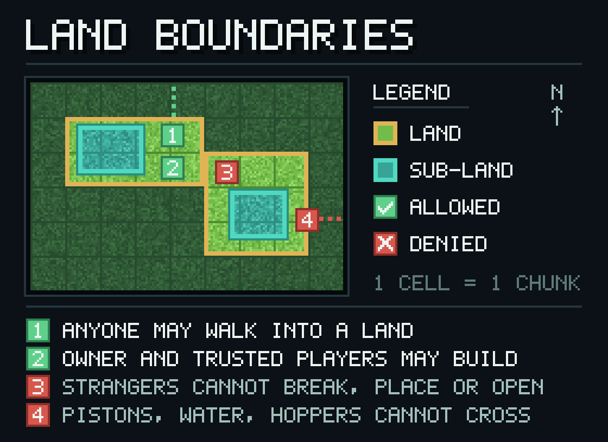

[English](../en/README.md) · [繁體中文](../zh-TW/README.md) · 简体中文

# ChunkLand 文档

ChunkLand 是给 **Folia 26.2** 用的领地保护插件。玩家用选区魔杖圈出一块地，从那之后，每一次破坏、放置、开箱、使用、战斗、进出的动作都会逐次判定，而不是等区块加载时检查一次就结束。

*示意图，不是实机截图。*

## 按你的角色找页

| 你是 | 从这里开始 |
| --- | --- |
| 要圈地的玩家 | [玩家指南](user-guide.md) |
| 要安装或配置的服务端管理员 | [服务器管理指南](server-guide.md) |
| 要在自己的插件里调用 ChunkLand | [开发者指南](developer-guide.md) |
| 要查命令、权限节点、配置项或 API | [参考区](reference/) |
| 想先知道哪里还有问题 | [已知限制](limitations.md) |

想先看整体介绍，从仓库根目录的 [README.zh-CN.md](../../README.zh-CN.md) 开始；变更记录在 [CHANGELOG.md](../../CHANGELOG.md)。

## 装之前要确认的三件事

| 项目 | 版本 |
| --- | --- |
| 服务器 | Folia 26.2（Paper 不是受支持的运行环境） |
| Java | 25 |
| 必装插件 | AceLib 1.3.0 |

插件描述文件里的 `api-version: '26.1.2'` 与编译用的 paper-api 26.1.2 都是编译标记，不是兼容性声明。

当前正式版是 **0.1.0**：插件 jar 可从 [GitHub Release](https://github.com/smile-minecraft/ChunkLand/releases/tag/v0.1.0) 下载，API 构件发在 JitPack（`https://jitpack.io`）的根坐标 `com.github.smile-minecraft:ChunkLand:v0.1.0`。拿 jar 的步骤写在[服务器管理指南](server-guide.md#装起来)里，引入 API 的写法在 [API 参考](reference/api.md)。

## 文档约定

- 三种语言各有一套同名文件：`docs/en/`、`docs/zh-TW/`、`docs/zh-CN/`。改动其中一份，另外两份要在同一次改动里跟上。
- 命令名、参数、配置键、权限节点、枚举值一律保持原样，不翻译。描述和解释用各自语言分开写。
- 规范性说法（必须、默认、范围）都能回到 `plugin.yml`、`config.yml`、语言文件或代码。查不到出处的说法不写进文档。
- 版本号、默认值、取值范围从源码复制，不凭印象写。
- 已知的坏行为集中写在[已知限制](limitations.md)，其他页面遇到时链过去，不各写一份。

## 授权

MIT，见 [LICENSE](../../LICENSE)。