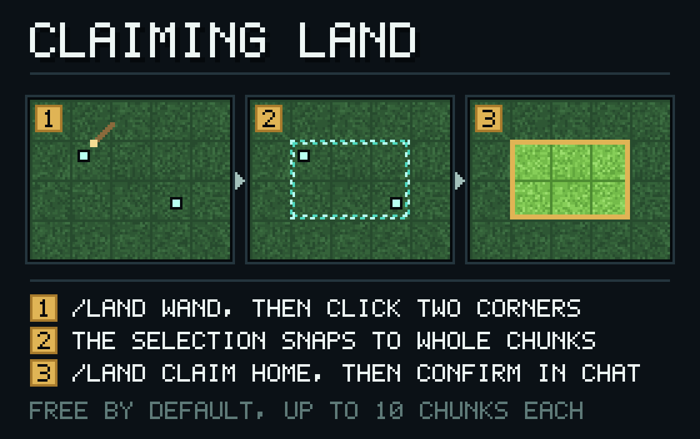
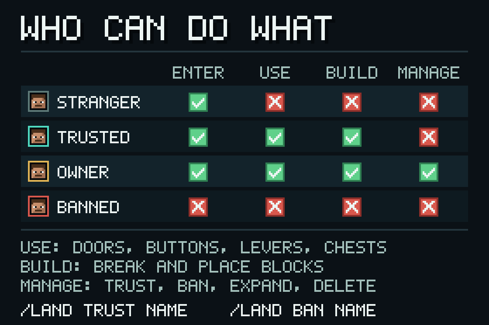
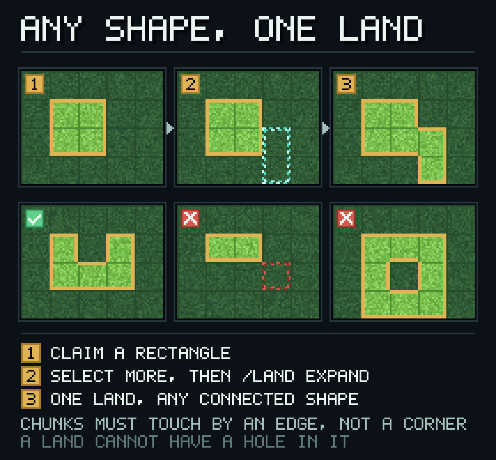
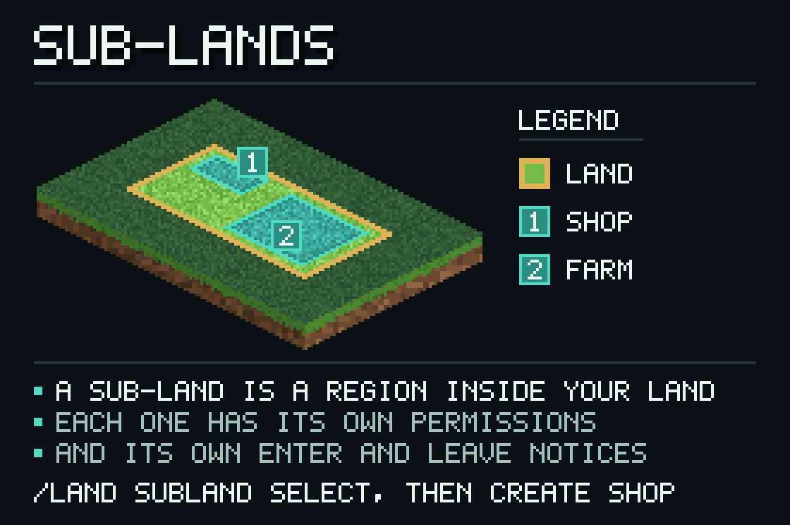
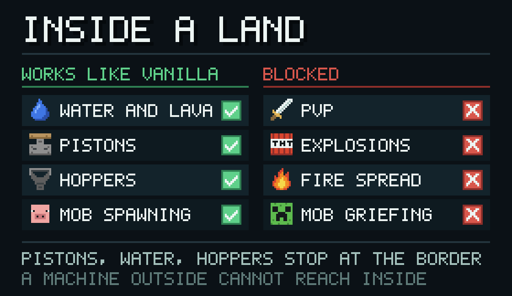

[English](../en/user-guide.md) · [繁體中文](../zh-TW/user-guide.md) · [文档索引](README.md)

# ChunkLand 玩家指南

这份指南写给要圈地、信任朋友、管理自己领地的玩家。服主要在安装和配置上花的功夫，看[服务器管理指南](server-guide.md)。

## 先确认一件事：权限节点默认全部是 op

插件的 29 个权限节点默认值都是 `op`，所以刚装好的服务器上只有管理员能用圈地、信任成员、打开管理界面这些命令。普通玩家要用，得服主先授权，否则命令会被直接拒绝。插件没有面向玩家的开关，各节点列在[权限参考](reference/permissions.md)。

## 圈一块地



```
/land wand          # 拿到选区魔杖
                    # 点一个角，再点对角
/land claim Home    # 取名，随后出现可点击的确认消息
```

选区魔杖只能在背包还塞得下的时候拿到，塞满会有提示。

确认消息会写明区块数、价格、冲突区块数和最低高度 minY。点确认就成立；也可以照消息里的提示手动输入：

```
/land confirm <generation> <revision> <land_name>
```

三个参数就是确认消息里的那一组。确认有时效，过期之后不会默默生效，需要重新看一次详情再确认。

圈地有额度上限，服务器管理员可以调。当前内置默认是每人 5 块领地、每人合计 10 个区块、每块领地 10 个区块、每块领地 16 个子领地；`/land inspect` 会把上限和它的来源一起显示出来。

### 选区只能是矩形

魔杖的左右键作用相同：第一次点击固定一个角，之后的点击移动另一个角，整块选区始终是一个矩形。没有「左键加区块、右键减区块」这种逐块调整。要覆盖不规则的形状，只能分几次圈选，再用 `/land expand` 或 `/land shrink` 修整。

## 看清楚当前这块地

```
/land inspect
/land explain BLOCK_BREAK
```

`/land inspect` 显示主人、区块数、子领地数、服务器领地标记、管理人、结构版本号和策略版本号，后面附带可直接点击的信任、封禁、改名和管理界面入口。带一个玩家名参数时，查询主体会换成那名玩家。

`/land explain` 回答「这个动作在这里为什么放行或拒绝」。它一次给全结果、由哪一层判定、判定来源、你是不是主人、admin bypass 有没有开、是不是 server-land 管理人，以及命中的子领地。动作名用 `ProtectionActionType` 里的枚举名，不区分大小写，直接按 Tab 会列出全部合法名字，例如 `BLOCK_BREAK`、`BLOCK_PLACE`、`CONTAINER_OPEN`、`ENTRY`、`PLAYER_DAMAGE_PLAYER`。写错名字就没有结果。

**这两条命令和大部分领地命令都要求你站在自己要处理的那块领地里面**，站在外面会被提示回去站好。

## 让别人能进来、能动手



```
/land trust <player>     # 信任
/land untrust <player>   # 取消信任
/land ban <player>       # 封禁
/land unban <player>     # 解封
```

封禁在领地绑定层以拒绝优先，效力高于世界和全局默认，`ENTRY` 设成放行也拦不住它。要注意的是封禁不是即时驱赶：对方已经站在领地里面的话，要等他下一次移动才会被推出去，推回优先送到最近的已验证出口（边界外约 3 格），找不到出口才送回世界重生点。反复闯入时推回之间有冷却，默认 500 毫秒，可用 `feedback.push-out-cooldown-millis` 调整。

### 关于离线玩家

命令接受玩家名，但名字必须能解析成服务器认识的 UUID：这个玩家曾在这台服务器登录过，或者当前在线。曾提出现在一次都没出现过的名字会被拒绝，提示找不到该玩家。要指定离线玩家，请用精确名字或 UUID。管理界面的成员页只能从在线玩家里挑人，离线的走上面的聊天指令。

## 用管理界面

`/land manage` 打开两层界面：

- 权限页列出各动作的当前默认值和来源，切换之前会先要求确认；
- 成员页和封禁名页可以查看现有内容、翻页、增删条目，返回键回到上一层。

同样要站在你管理的领地里面，权限不够会被拒绝。成员页的「新增」只能从在线玩家中挑选；离线玩家请用 `/land trust` 加入，用 `/land unban` 解除封禁。

Bedrock 客户端进来时，界面上有些步骤还没有对应的表单，会提示改用聊天指令。

## 调整范围与名称



| 命令 | 做什么 |
| --- | --- |
| `/land expand` | 把当前选区并入你脚下的领地 |
| `/land shrink` | 从领地移除选中的区块，按每块区块的实际成本退款 |
| `/land unclaim` | 与 `shrink` 同一套流程 |
| `/land rename <new_name>` | 改显示名 |
| `/land delete` | 永久删除领地并全额退款 |

`expand`、`shrink`、`delete` 都要你先站在目标领地里。`shrink` 会告诉你退了多少；退款还在处理中时，提示会写明正在处理。缩到整个领地都没了会被拦下，这时改用 `/land delete`。

`delete` 分两步：先 `/land delete`，拿到带 `<revision>` 的确认提示，再执行 `/land delete confirm <revision>`。删除不可撤销。

## 子领地



```
/land subland select                        # 开会话，再用魔杖划范围
/land subland create <generation> <revision> <name>
```

`subland` 的子命令是 `select`、`create`、`update`、`delete`、`extend`。`select` 之后才能用魔杖圈子领地范围；`create`、`update`、`delete`、`extend` 可以带 `<generation> <revision>` 和名字。

两个提示值得留意。子领地往父领地保护底线以下延伸时，会要求额外的深度确认，消息里给出要跑的命令，照着跑一次就行。深度延伸写入之后，执行期索引的刷新有时序差，所以提示会叫你「再跑一次建立或更新确认」——直接重下一次就行，不用重划选区。

## 十一项领地规则现在改不了



PVP、地形爆炸、实体爆炸、火焰蔓延、火焰烧毁、生物破坏、水流、活塞、漏斗传输、敌对生物生成、被动生物生成这十一项没有任何玩家或管理界面可以调整，一律走内置默认：水流、活塞、漏斗传输与敌对／被动生物生成在领地内照原版运作；PVP、爆炸、火焰蔓延与烧毁、生物破坏一律拒绝。活塞、液体、漏斗只要跨越领地边界（不论进出，也包含你自己相邻的两块领地之间）一律拒绝。想开 PVP 场、用 TNT 开矿或让机器跨界，现在没有玩家端的路径，只能把整套机器盖在同一块领地内。

## 进出你的领地

`subject-defaults.global.ENTRY` 默认是 `ALLOW`，也就是没被你信任过的人也能走进已加载的领地。要对陌生人关上门，服主可以把它改成 `DENY`：

```yaml
subject-defaults:
  global:
    ENTRY: DENY
```

被拒绝进入时，玩家会被退回跨界一侧约 3 格；空间不足时会缩短退后距离，实在找不到安全落点就退回原处。所有落点只用已加载区块，不会为了找位置去加载新区块。

进入判定只看这一次移动的起点和终点，中间经过的位置不查。由此有两个已知缺口：极薄的子领地可以被高速移动直接穿过（鞘翅、冰上船、高速坠落都算），管理端 `/tp` 传送不受拦截。两者的细节都在[已知限制](limitations.md)。

## 遇到奇怪行为

先看[已知限制](limitations.md)：点火没有保护、`/tp` 不受拦截、被封禁的人要等下一次移动、拒绝提示只用服务器默认语言、选区只能矩形、子领地深度延伸后要重跑确认。

要查具体命令的用法，看[命令参考](reference/commands.md)。

## 相关页面

- [文档索引](README.md)
- [服务器管理指南](server-guide.md)
- [已知限制](limitations.md)
- [命令参考](reference/commands.md) · [权限参考](reference/permissions.md)